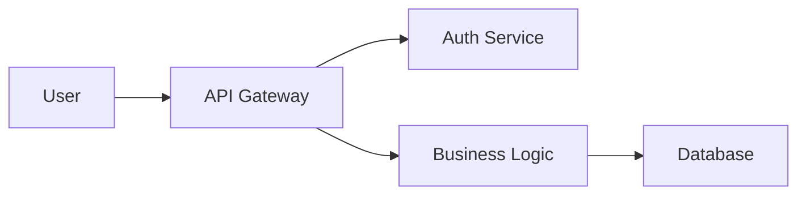
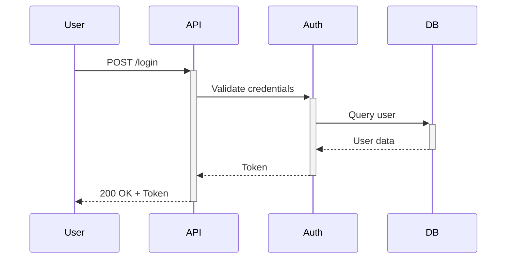

# Documentation Structure Standard
# 文件結構標準

**Version**: 1.1.0
**Last Updated**: 2025-12-11
**Applicability**: All software projects requiring documentation
**適用範圍**: 所有需要文件的軟體專案

---

## Purpose | 目的

This standard defines a consistent documentation structure for software projects, ensuring information is organized, discoverable, and maintainable.

本標準定義軟體專案的一致文件結構，確保資訊的組織性、可發現性與可維護性。

---

## Standard Documentation Structure | 標準文件結構

```
project-root/
├── README.md                    # Project overview (REQUIRED)
├── CONTRIBUTING.md              # Contribution guidelines
├── CHANGELOG.md                 # Version history
├── LICENSE                      # License file
├── .claude/ or .standards/      # Development standards
│   ├── anti-hallucination.md
│   ├── checkin-standards.md
│   ├── commit-guide.md
│   └── ...
├── docs/                        # Detailed documentation
│   ├── index.md                 # Documentation index
│   ├── getting-started.md       # Quick start guide
│   ├── architecture.md          # System architecture
│   ├── api-reference.md         # API documentation
│   ├── deployment.md            # Deployment guide
│   ├── troubleshooting.md       # Common issues
│   └── diagrams/                # Architecture diagrams
│       ├── system-overview.mmd
│       ├── data-flow.mmd
│       └── README.md
└── examples/                    # Code examples
    ├── basic-usage/
    ├── advanced-usage/
    └── README.md
```

---

## File Naming Conventions | 檔案命名規範

### Root Directory Files | 根目錄檔案

Root-level documentation files should use **UPPERCASE** naming for GitHub/GitLab auto-recognition:

根目錄的文件檔案應使用**大寫**命名，以便 GitHub/GitLab 自動識別：

| File | Naming | Reason |
|------|--------|--------|
| `README.md` | UPPERCASE | GitHub/GitLab auto-displays on repo page |
| `CONTRIBUTING.md` | UPPERCASE | GitHub auto-links in PR creation |
| `CHANGELOG.md` | UPPERCASE | Keep a Changelog convention |
| `LICENSE` | UPPERCASE (no extension) | GitHub auto-detects license type |
| `CODE_OF_CONDUCT.md` | UPPERCASE | GitHub community standard |
| `SECURITY.md` | UPPERCASE | GitHub security advisory standard |

### docs/ Directory Files | docs/ 目錄檔案

All files within `docs/` should use **lowercase-kebab-case** for URL friendliness:

`docs/` 目錄內的所有檔案應使用 **lowercase-kebab-case** 以確保 URL 友善：

✅ **Correct | 正確**:
```
docs/
├── index.md
├── getting-started.md
├── api-reference.md
└── user-guide.md
```

❌ **Incorrect | 錯誤**:
```
docs/
├── INDEX.md           # Inconsistent casing
├── GettingStarted.md  # PascalCase not URL-friendly
├── API_Reference.md   # snake_case inconsistent
└── User Guide.md      # Spaces cause URL issues
```

**Rationale | 理由**:
- Lowercase avoids case-sensitivity issues across OS (Windows vs Linux)
- Kebab-case produces clean URLs: `docs/getting-started` vs `docs/GettingStarted`
- Consistent naming improves discoverability and automation

---

## Core Documentation Files | 核心文件檔案

### 1. README.md (REQUIRED) | 專案自述（必要）

**Purpose**: First impression, quick overview
**目的**: 第一印象、快速概覽

**Template**:
```markdown
# Project Name

Brief one-liner description

## Features

- Feature 1
- Feature 2
- Feature 3

## Quick Start

```bash
# Installation
npm install your-package

# Usage
npm start
```

## Documentation

See [docs/](docs/) for full documentation.

## Contributing

See [CONTRIBUTING.md](CONTRIBUTING.md).

## License

[License Name](LICENSE)
```

**Must Include | 必須包含**:
- [ ] Project name and description
- [ ] Quick start / installation
- [ ] Link to full docs
- [ ] License information

---

### 2. CONTRIBUTING.md (Recommended) | 貢獻指南（建議）

**Purpose**: How to contribute to the project
**目的**: 如何貢獻專案

**Template**:
```markdown
# Contributing Guidelines

## Development Setup

```bash
git clone https://github.com/org/repo
cd repo
npm install
```

## Workflow

1. Fork the repository
2. Create feature branch: `git checkout -b feature/my-feature`
3. Commit changes: `git commit -m "feat: add feature"`
4. Push branch: `git push origin feature/my-feature`
5. Create pull request

## Coding Standards

- Follow [.claude/csharp-style.md](.claude/csharp-style.md)
- Run `npm run lint` before committing
- Ensure tests pass: `npm test`

## Commit Message Format

See [.claude/commit-guide.md](.claude/commit-guide.md)

## Code Review Process

See [.claude/code-review-checklist.md](.claude/code-review-checklist.md)
```

**Must Include | 必須包含**:
- [ ] Development setup instructions
- [ ] Contribution workflow
- [ ] Coding standards reference
- [ ] Testing requirements

---

### 3. CHANGELOG.md (Recommended) | 變更日誌（建議）

**Purpose**: Track changes between versions
**目的**: 追蹤版本間變更

**Format**: Follow [Keep a Changelog](https://keepachangelog.com/)

```markdown
# Changelog

## [Unreleased]

### Added
- New feature X

### Fixed
- Bug fix Y

## [1.2.0] - 2025-11-12

### Added
- OAuth2 authentication support

### Changed
- Updated API response format

### Deprecated
- Old API endpoint (will be removed in v2.0)

## [1.1.0] - 2025-10-01

### Added
- Email notification system

[Unreleased]: https://github.com/org/repo/compare/v1.2.0...HEAD
[1.2.0]: https://github.com/org/repo/compare/v1.1.0...v1.2.0
[1.1.0]: https://github.com/org/repo/releases/tag/v1.1.0
```

---

### 4. LICENSE (REQUIRED for open source) | 授權（開源必要）

**Common Licenses**:
- MIT: Permissive
- Apache 2.0: Permissive with patent grant
- GPL v3: Copyleft
- BSD: Permissive
- CC BY 4.0: Documentation/content

---

## Document Version Alignment | 文件版本對齊

### Principle | 原則

**Document version MUST align with software version.**

**文件版本必須與軟體版本對齊。**

The version number in a document represents "applicable to software version X.Y.Z", not an independent document revision number.

文件中的版本號代表「適用於軟體版本 X.Y.Z」，而非獨立的文件修訂號。

### Rationale | 理由

| Approach | Problems |
|----------|----------|
| Independent doc version | Requires tracking "which doc version maps to which software version"; confusing |
| **Aligned version** ✓ | Clear: doc v1.2.0 = applies to software v1.2.0 |

### Document Header Template | 文件標頭範本

```markdown
# Document Title | 文件標題

**Applicable Version**: 1.2.0    ← Aligned with software version
**適用版本**: 1.2.0
**Document Type**: [Guide/Reference/Specification]
**文件類型**: [指南/參考/規格]
**Target Audience**: [Developers/Operators/Users]
**目標讀者**: [開發者/維運/使用者]
**Last Updated**: 2025-12-11     ← Date of last edit
**文件更新日期**: 2025-12-11

---
```

### Field Definitions | 欄位定義

| Field | Required | Description |
|-------|----------|-------------|
| Applicable Version / 適用版本 | ✅ Yes | The software version this document applies to |
| Document Type / 文件類型 | Recommended | Category: Guide, Reference, Specification, Tutorial |
| Target Audience / 目標讀者 | Recommended | Intended readers |
| Last Updated / 文件更新日期 | ✅ Yes | Date of last edit |

### When to Update Version | 何時更新版本

| Scenario | Action |
|----------|--------|
| Software releases new version with feature changes | Update doc version to match |
| Minor doc typo fix (no software change) | Keep version, update Last Updated date only |
| Doc updated for upcoming release | Use new version number |

### Examples | 範例

✅ **Correct**:
```markdown
# Upgrade Guide

**Applicable Version**: 1.2.0
**Last Updated**: 2025-12-11
```
This means: "Use this guide when upgrading to v1.2.0"

❌ **Incorrect**:
```markdown
# Upgrade Guide

**Version**: 1.1        ← Ambiguous: document revision or software version?
**Updated**: 2025-12-11
```

---

## Detailed Documentation (`docs/`) | 詳細文件

### docs/index.md

**Purpose**: Navigation hub for all documentation
**目的**: 所有文件的導覽中心

**Template**:
```markdown
# Documentation Index

## By Role

### For Users
- [Getting Started](getting-started.md)
- [User Guide](user-guide.md)
- [FAQ](faq.md)

### For Developers
- [Architecture](architecture.md)
- [API Reference](api-reference.md)
- [Development Guide](development-guide.md)

### For Operators
- [Deployment Guide](deployment.md)
- [Configuration](configuration.md)
- [Troubleshooting](troubleshooting.md)

## By Topic

### Authentication
- [Architecture](architecture.md#authentication)
- [API Endpoints](api-reference.md#authentication)

### Database
- [Schema](architecture.md#database-schema)
- [Migrations](development-guide.md#database-migrations)

## Quick Links

- [GitHub Repository](https://github.com/org/repo)
- [Issue Tracker](https://github.com/org/repo/issues)
- [Changelog](../CHANGELOG.md)
```

---

### docs/getting-started.md

**Purpose**: Quick start for new users
**目的**: 新使用者快速入門

**Structure**:
1. Prerequisites
2. Installation
3. Basic Configuration
4. First Example
5. Next Steps

---

### docs/architecture.md

**Purpose**: System design and technical architecture
**目的**: 系統設計與技術架構

**Structure**:
1. Overview
2. System Components
3. Data Flow
4. Design Decisions
5. Technology Stack
6. Security Architecture
7. Performance Considerations

**Include Diagrams**:
- System overview diagram
- Component diagram
- Data flow diagram
- Deployment diagram

---

### docs/api-reference.md

**Purpose**: Complete API documentation
**目的**: 完整 API 文件

**Structure**:
1. API Overview
2. Authentication
3. Endpoints (grouped by resource)
4. Request/Response Examples
5. Error Codes
6. Rate Limiting

**Endpoint Template**:
```markdown
## POST /api/users/authenticate

Authenticates a user and returns access token.

### Request

**Headers**:
```
Content-Type: application/json
```

**Body**:
```json
{
  "username": "string",
  "password": "string"
}
```

### Response

**Success (200 OK)**:
```json
{
  "accessToken": "string",
  "expiresIn": 3600
}
```

**Error (401 Unauthorized)**:
```json
{
  "error": "INVALID_CREDENTIALS",
  "message": "Invalid username or password"
}
```

### Examples

```bash
curl -X POST https://api.example.com/api/users/authenticate \
  -H "Content-Type: application/json" \
  -d '{"username":"user@example.com","password":"secret"}'
```
```

---

### docs/deployment.md

**Purpose**: How to deploy the application
**目的**: 如何部署應用程式

**Structure**:
1. Prerequisites
2. Environment Setup
3. Configuration
4. Deployment Steps
5. Verification
6. Rollback Procedure
7. Monitoring

---

### docs/troubleshooting.md

**Purpose**: Common problems and solutions
**目的**: 常見問題與解決方案

**Structure**:
```markdown
# Troubleshooting Guide

## Installation Issues

### Problem: npm install fails with EACCES error

**Symptoms**:
```
Error: EACCES: permission denied
```

**Solution**:
```bash
sudo chown -R $(whoami) ~/.npm
npm install
```

---

## Runtime Issues

### Problem: Application crashes with "Cannot find module"

**Symptoms**:
- Error: Cannot find module 'express'
- Application exits immediately

**Solution**:
1. Check node_modules exists
2. Run `npm install`
3. Verify package.json dependencies

**Prevention**:
- Always run `npm install` after pulling changes
- Commit package-lock.json to version control
```

---

## Diagram Documentation | 圖表文件

### Recommended Tools | 建議工具

- **Mermaid**: Text-based diagrams (GitHub/GitLab native support)
- **PlantUML**: UML diagrams from text
- **Draw.io / Excalidraw**: Visual diagram editors
- **ASCII Art**: Simple text diagrams

### Mermaid Examples | Mermaid 範例

**System Flow**:


**Sequence Diagram**:


---

## Code Examples (`examples/`) | 程式碼範例

### Structure | 結構

```
examples/
├── README.md                   # Overview of examples
├── basic-usage/
│   ├── simple-auth.js         # Simple authentication example
│   ├── README.md              # Explanation
│   └── package.json           # Dependencies
├── advanced-usage/
│   ├── custom-auth.js         # Advanced authentication
│   ├── README.md
│   └── package.json
└── integration-tests/
    └── ...
```

### Example README Template | 範例 README 範本

```markdown
# Basic Usage Examples

## Simple Authentication

Demonstrates basic user authentication flow.

### Prerequisites

- Node.js 18+
- npm 9+

### Setup

```bash
cd examples/basic-usage
npm install
```

### Run

```bash
node simple-auth.js
```

### Expected Output

```
User authenticated successfully!
Token: eyJhbGc...
```

### Code Walkthrough

```javascript
// 1. Import library
const { AuthClient } = require('your-lib');

// 2. Create client
const client = new AuthClient({
  apiUrl: 'https://api.example.com'
});

// 3. Authenticate
const token = await client.authenticate('user', 'pass');
console.log('Token:', token);
```
```

---

## Documentation Maintenance | 文件維護

### Documentation Updates Checklist | 文件更新檢查清單

When making code changes, update documentation:

- [ ] **README.md** if:
  - Installation process changed
  - Quick start example changed
  - New major feature added

- [ ] **API Reference** if:
  - API endpoints added/changed/removed
  - Request/response format changed
  - New error codes introduced

- [ ] **Architecture Docs** if:
  - System design changed
  - New components added
  - Technology stack changed

- [ ] **CHANGELOG.md** (always):
  - Add entry for every release
  - Document breaking changes
  - List new features and fixes

---

## Documentation Quality Standards | 文件品質標準

### Readability | 可讀性

- [ ] Clear, concise language
- [ ] Short paragraphs (≤5 sentences)
- [ ] Active voice preferred
- [ ] Technical jargon explained

### Accuracy | 準確性

- [ ] Code examples tested and working
- [ ] Screenshots/diagrams up-to-date
- [ ] Version numbers correct
- [ ] Links not broken

### Completeness | 完整性

- [ ] Prerequisites listed
- [ ] All steps documented
- [ ] Expected outcomes described
- [ ] Troubleshooting included

---

## Localization | 本地化

### Bilingual Documentation | 雙語文件

For international projects:

```
docs/
├── en/                        # English documentation
│   ├── README.md
│   ├── getting-started.md
│   └── ...
├── zh-tw/                     # Traditional Chinese
│   ├── README.md
│   ├── getting-started.md
│   └── ...
└── README.md                  # Language selector
```

**Language Selector (root docs/README.md)**:
```markdown
# Documentation

Select your language:
- [English](en/README.md)
- [繁體中文](zh-tw/README.md)
- [日本語](ja/README.md)
```

---

## Documentation Automation | 文件自動化

### API Documentation Generation | API 文件自動生成

**Tools**:
- **Swagger/OpenAPI**: REST API documentation
- **GraphQL**: Auto-generated schema docs
- **JSDoc**: JavaScript API docs
- **Doxygen**: C/C++ documentation
- **Sphinx**: Python documentation
- **Docusaurus**: Full documentation sites

### Example: Swagger Integration

```yaml
# openapi.yaml
openapi: 3.0.0
info:
  title: User API
  version: 1.0.0

paths:
  /users/authenticate:
    post:
      summary: Authenticate user
      requestBody:
        required: true
        content:
          application/json:
            schema:
              type: object
              properties:
                username:
                  type: string
                password:
                  type: string
      responses:
        '200':
          description: Success
          content:
            application/json:
              schema:
                type: object
                properties:
                  accessToken:
                    type: string
```

---

## Documentation Hosting | 文件托管

### Options | 選項

| Platform | Best For | Cost |
|----------|----------|------|
| **GitHub Pages** | Open source projects | Free |
| **GitLab Pages** | GitLab projects | Free |
| **Read the Docs** | Python projects | Free |
| **Docusaurus** | Full documentation sites | Free (self-hosted) |
| **GitBook** | Beautiful docs UI | Free tier available |

### GitHub Pages Setup

```bash
# 1. Create docs branch
git checkout --orphan gh-pages

# 2. Add documentation
cp -r docs/* .

# 3. Push to GitHub
git add .
git commit -m "docs: initial documentation"
git push origin gh-pages

# 4. Enable in GitHub Settings → Pages
# Choose gh-pages branch
```

---

## Version History | 版本歷史

| Version | Date | Changes |
|---------|------|---------|
| 1.1.0 | 2025-12-11 | Added: File naming conventions, Document version alignment standard |
| 1.0.0 | 2025-11-12 | Initial documentation structure standard |

---

## References | 參考資料

- [Write the Docs](https://www.writethedocs.org/)
- [Google Developer Documentation Style Guide](https://developers.google.com/style)
- [Microsoft Writing Style Guide](https://docs.microsoft.com/en-us/style-guide/)

---

## License | 授權

This standard is released under [CC BY 4.0](https://creativecommons.org/licenses/by/4.0/).

本標準以 [CC BY 4.0](https://creativecommons.org/licenses/by/4.0/) 授權發布。
